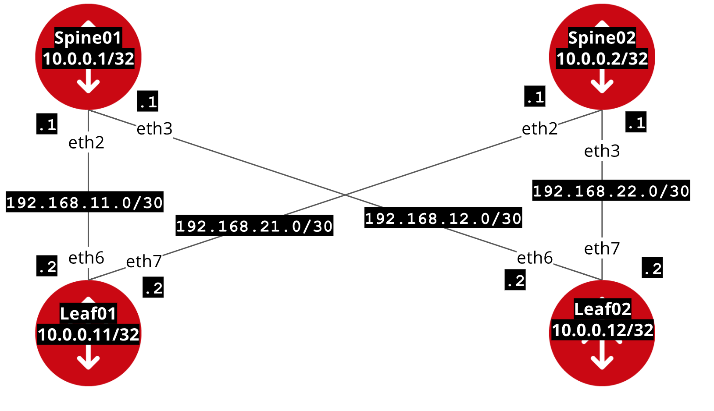

# Exercise 04 - Configuring IP Addresses

For this exercise we are going to configure IP address between the leaf and spines. For this exercise we are going to use the [vyos_l3_interface module](http://docs.ansible.com/ansible/latest/vyos_l3_interface_module.html) and the [aggregate resources feature](https://www.ansible.com/blog/accelerate-ansible-networking-aggregate-resources).

Here is the IP address diagram:


Device Left | IP Address for Device Left | IP Address for Device Right | Device Right
------------ | ------------- | ------------- | -------------
spine01 | 192.168.11.1/30 | 192.168.11.2/30 | leaf01
spine01 | 192.168.12.1/30 | 192.168.12.2/30 | leaf02
spine02 | 192.168.21.1/30 | 192.168.21.2/30 | leaf01
spine02 | 192.168.22.1/30 | 192.168.22.2/30 | leaf02


Look at the following playbook:

```yml

```

To run the playbook use the `ansible-playbook` command.  The default password is vagrant for the vyos vagrant image.

```bash
ansible-playbook system.yml -u vagrant -k
```
Parameter | Explanation
------------ | -------------
ansible-playbook | Ansible executable for running playbooks
system.yml | the name of the playbook
-u vagrant | specifies user vagrant
-k | prompts us for password

# Looking at the results

Login to a device:
```
ssh vagrant@leaf01
```

To see what Ansible configured:


## Complete
You have completed exercise 04.

[Return to training-course](../README.md)
