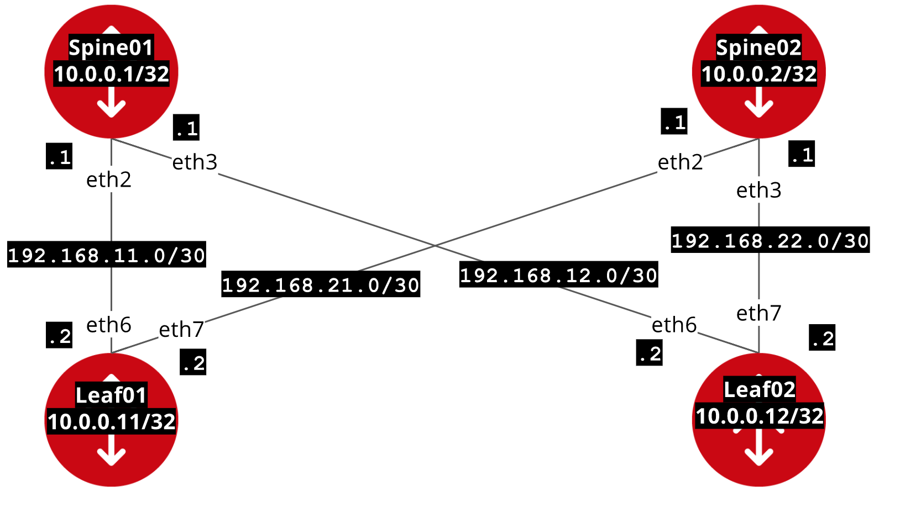

# Exercise 05 - Configuring OSPF Routing

For this exercise we are going to configure [OSPF routing](https://en.wikipedia.org/wiki/Open_Shortest_Path_First) using the [vyos_config](http://docs.ansible.com/ansible/latest/vyos_config_module.html) module.  We are going to put every interface into area 0, using the **interface_data** from before.  

Here is the IP address diagram from the previous exercise:


Look at the following playbook:

```yml
---
- hosts: network
  connection: network_cli
  vars:
    interface_data:
      spine01:
          - { name: lo, ipv4: 10.0.0.1/32 }
          - { name: eth2, ipv4: 192.168.11.1/30 }
          - { name: eth3, ipv4: 192.168.12.1/30 }
      spine02:
          - { name: lo, ipv4: 10.0.0.2/32 }
          - { name: eth2, ipv4: 192.168.21.1/30 }
          - { name: eth3, ipv4: 192.168.22.1/30 }
      leaf01:
          - { name: lo, ipv4: 10.0.0.11/32 }
          - { name: eth6, ipv4: 192.168.11.2/30 }
          - { name: eth7, ipv4: 192.168.21.2/30 }
      leaf02:
          - { name: lo, ipv4: 10.0.0.12/32 }
          - { name: eth6, ipv4: 192.168.12.2/30 }
          - { name: eth7, ipv4: 192.168.22.2/30 }
  tasks:
    - name: create routing config
      template:
        src: ./ospf.j2
        dest: ./routing_config/{{inventory_hostname}}-routing.cfg

    - name: push config to device
      vyos_config:
        src: ./routing_config/{{inventory_hostname}}-routing.cfg
        save: yes
```

To run the playbook use the `ansible-playbook` command.  The default password is vagrant for the vyos vagrant image.

```bash
ansible-playbook ospf.yml -u vagrant -k
```
Parameter | Explanation
------------ | -------------
ansible-playbook | Ansible executable for running playbooks
system.yml | the name of the playbook
-u vagrant | specifies user vagrant
-k | prompts us for password

# Looking at the results

Login to a device:
```
ssh vagrant@spine01
```

Use the `show ip ospf neigh` command to look for OSPF neighborship adjacencies

```
vagrant@spine01:~$ show ip ospf neigh

    Neighbor ID Pri State           Dead Time Address         Interface            RXmtL RqstL DBsmL
10.0.0.11         1 Full/DROther      32.272s 192.168.11.2    eth2:192.168.11.1        0     0     0
10.0.0.12         1 Full/DROther      32.245s 192.168.12.2    eth3:192.168.12.1        0     0     0
```

Check the route table with the `show ip route` command.  There should be a route for 10.0.0.1, 10.0.0.2, 10.0.0.11 and 10.0.0.12 which represent the 4 vyos devices:

Device | Loopback Address
------------ | -------------
spine01 | 10.0.0.1
spine02 | 10.0.0.2
leaf01 | 10.0.0.11
leaf02 | 10.0.0.12


```
vagrant@spine01:~$ show ip route
Codes: K - kernel route, C - connected, S - static, R - RIP, O - OSPF,
       I - ISIS, B - BGP, > - selected route, * - FIB route

S>* 0.0.0.0/0 [210/0] via 10.0.2.2, eth0
O   10.0.0.1/32 [110/10] is directly connected, lo, 00:15:16
C>* 10.0.0.1/32 is directly connected, lo
O>* 10.0.0.2/32 [110/30] via 192.168.11.2, eth2, 00:15:14
  *                      via 192.168.12.2, eth3, 00:15:14
O>* 10.0.0.11/32 [110/20] via 192.168.11.2, eth2, 00:15:17
O>* 10.0.0.12/32 [110/20] via 192.168.12.2, eth3, 00:15:16
C>* 10.0.0.111/32 is directly connected, lo
C>* 10.0.2.0/24 is directly connected, eth0
C>* 127.0.0.0/8 is directly connected, lo
C>* 172.16.10.0/24 is directly connected, eth1
O   192.168.11.0/30 [110/10] is directly connected, eth2, 01:05:34
C>* 192.168.11.0/30 is directly connected, eth2
O   192.168.12.0/30 [110/10] is directly connected, eth3, 01:36:03
C>* 192.168.12.0/30 is directly connected, eth3
O>* 192.168.21.0/30 [110/20] via 192.168.11.2, eth2, 00:54:48
O>* 192.168.22.0/30 [110/20] via 192.168.12.2, eth3, 00:54:40
```

## Complete
You have completed exercise 05.

[Return to training-course](../README.md)
